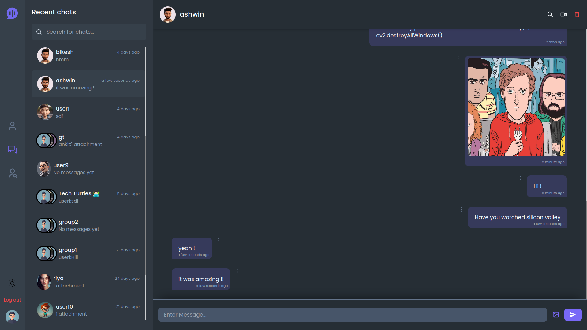
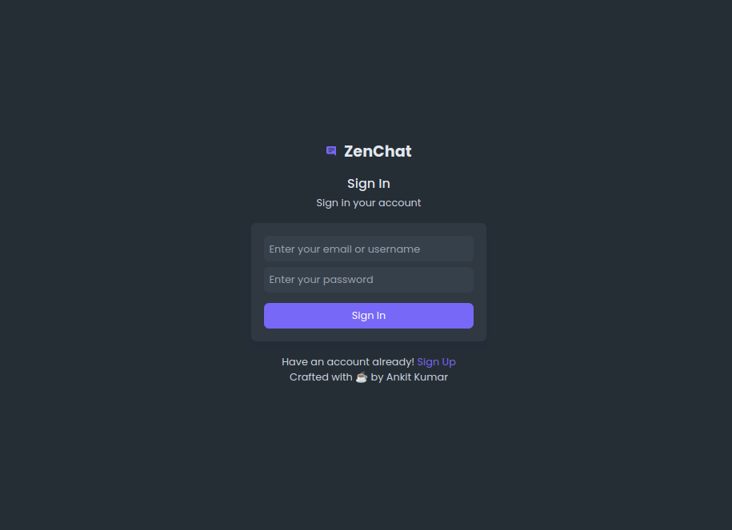
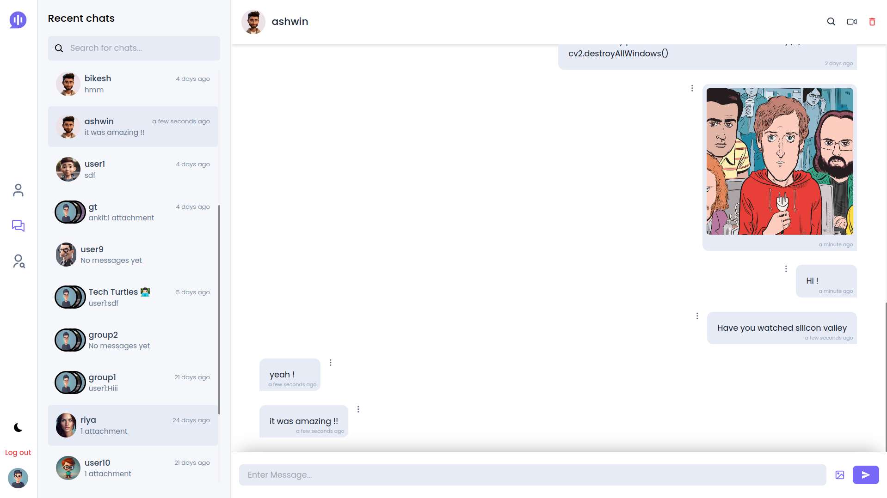
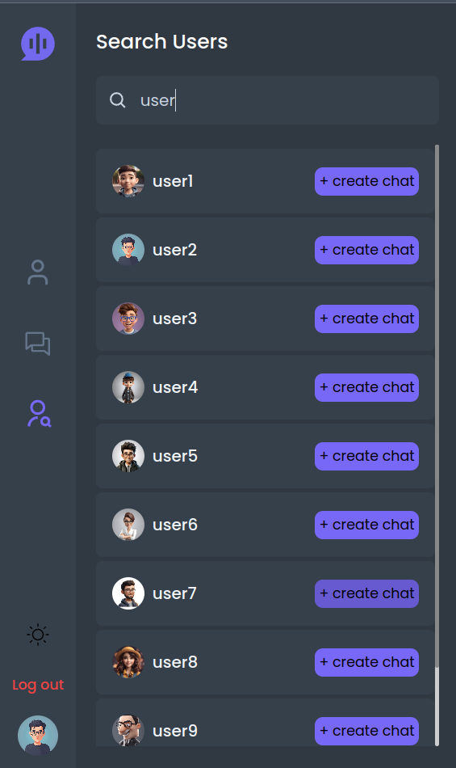
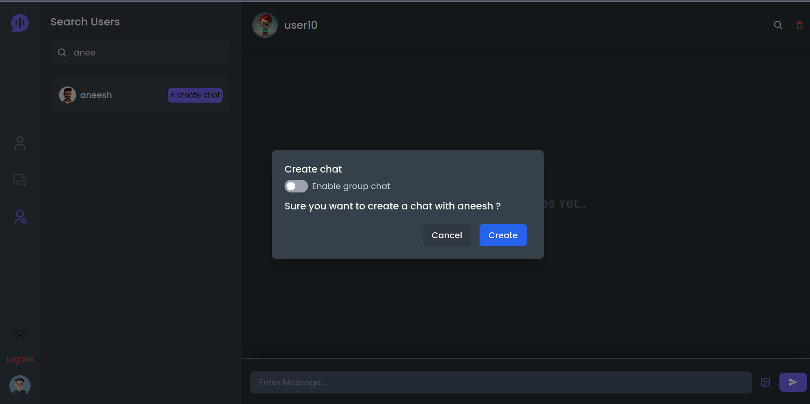
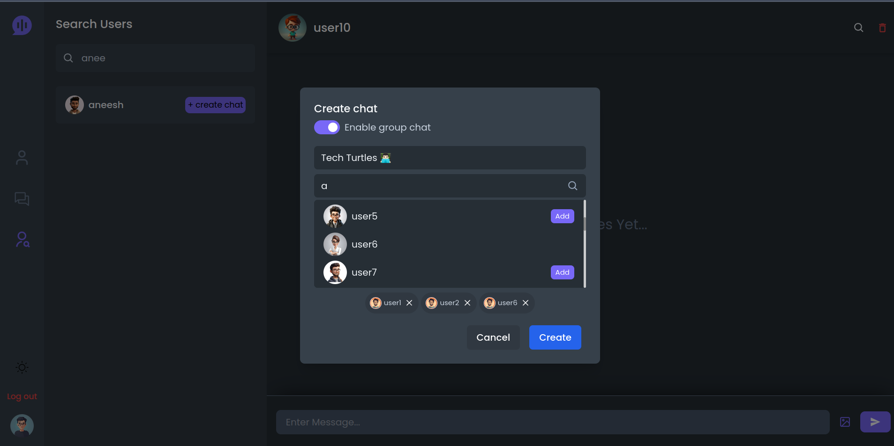
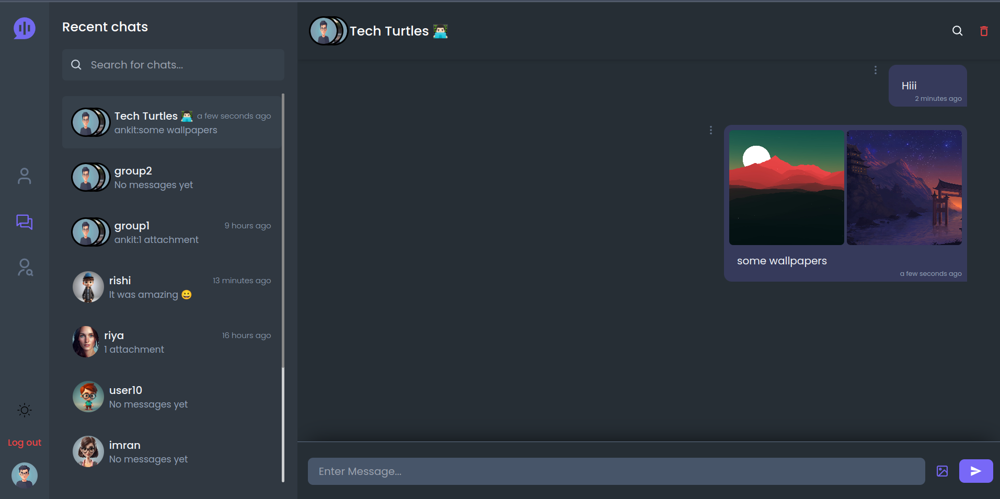

# zenChat



## Overview

This is a full-featured chat and video call application built using the MERN stack (MongoDB, Express.js, React, Node.js). The application supports one-to-one and group chats, and users can share images, text messages, and files. Also Supports one-to-one video chat.

## Features

- **One-to-One video chat:** you can make video call between two users.
- **One-to-One Chat:** Private messaging between two users.
- **Group Chat:** Messaging within a group of users.
- **Media Sharing:** Share images, files, and text messages.
- **Real-time Communication:** Powered by Socket.IO for real-time interactions.
- **Dark Mode Added** !!

## Technologies Used

### Frontend

- **React:** For building user interfaces.
- **Tailwind CSS:** For styling.
- **Vite:** For fast development and build process.
- **Axios:** For making HTTP requests.
- **Socket.IO Client:** For real-time communication.
- **React Router:** For client-side routing.
- **Moment.js:** For date and time formatting.

### Backend

- **Node.js:** For the server environment.
- **Express.js:** For the server framework.
- **MongoDB:** For the database.
- **Socket.IO:** For real-time bidirectional communication.
- **WebRTC:** For peer-to-peer data exchange.

## Installation

### Prerequisites

- Node.js
- MongoDB

### Backend Setup

1. Clone the repository:

   ```sh
   git clone https://github.com/AnkitKumar8080/zenChat.git
   cd zenChat
   ```

2. Navigate to the `backend` directory:

   ```sh
   cd backend
   ```

3. Install backend dependencies:

   ```sh
   npm install
   ```

4. Create a `.env` file in the `backend` directory, sample `.env.sample` file provided and add the following variables:

   ```env
   NODE_ENV=development
   PORT=5000
   CORS_URL=http://localhost:5173

   # database creds
   DB_URL="your mongodb url don't include database name it will be auto configured" can be any local or atlas EX Local: "mongodb://localhost:27017" EX Atlas: "mongodb+srv://<username>:<password>@cluster0.mongodb.net?retryWrites=true&w=majority"
   DB_NAME=ZenChat
   DB_MIN_POOL_SIZE=2
   DB_MAX_POOL_SIZE=5

   COOKIE_VALIDITY_SEC=172800
   ACCESS_TOKEN_VALIDITY_SEC=182800
   REFRESH_TOKEN_VALIDITY_SEC=604800
   TOKEN_ISSUER=api.zenchat.com
   TOKEN_AUDIENCE=zenchat.com

   JWT_SECRET_KEY=ad9acf5d38a4449da39dba841a4f339681f0a74bc7b014f9876cba55f48563fd

   ```

5. Start the backend server:

   ```sh
   npm run dev
   ```

### Frontend Setup

1. Navigate to the `client` directory:

   ```sh
   cd ../client
   ```

2. Install frontend dependencies:

   ```sh
   npm install
   ```

3. Create a `.env` file in the `client` directory, sample `.env.sample` file provided and add the following variables:

   ```env
   VITE_SERVER_URL=http://localhost:5000/
   VITE_SOCKET_URI=http://localhost:5000/
   ```

4. Start the frontend development server:

   ```sh
   npm run dev
   ```

## Usage

1. Open your browser and navigate to `http://localhost:5173`.
2. Register a new account or log in with an existing account.
3. Start a one-to-one chat by searching a user and creating a chat with him or create a new group chat.
4. Share images, files, and text messages in real-time.


## Scripts

### Backend

- `start`: Start the server.
- `dev`: Start the server in development mode with nodemon.

### Frontend

- `dev`: Start the development server with Vite.
- `build`: Build the application for production.
- `preview`: Preview the production build.
- `lint`: Run ESLint.

## Screenshots

### Login Screen



### Chat Interface



### Create a One to One Chat

#### Search users to create chat with

#### click on create chat

#### modal will pop create a one to one or a group chat

  

### Group Chat


